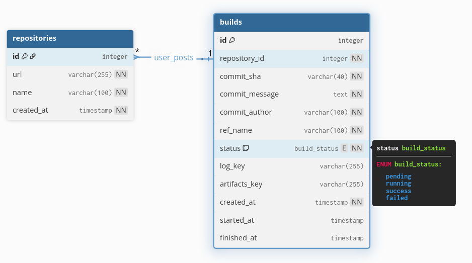

# План технического задания на разработку системы непрерывной интеграции "Swompi-Runner"

## Введение

* **Наименование проекта:** Разработка системы непрерывной интеграции "Swompi-Runner".
* **Цели и назначение документа:** to-do
* **Область применения:** to-do
* **Термины и определения:** to-do (Пайплайн, Сборка/Билд, Веб-хук, Артефакт, Исполнитель/Executor, .myci.yml).

## Общие сведения о проекте

* **Заказчик:** Чернышев, ГУАП
* **Исполнитель:** Орлова С.Н., Ершова О.А.
* **Основание для разработки:** Курсовой проект по дисциплине «Технологии программирования».

## Требования к системе

### Функциональные требования

#### Общие требования

* Система должна запускать pipeline в ответ на веб-хуки от GitHub.
* Конфигурация pipeline должна считываться из файла .swompi.yml в корне репозитория.
* Каждая сборка должна выполнятся в Docker контейнере.

#### Требования к модулю обработки веб-хуков

* Наличие HTTP-endpoint для приема POST-запросов
* Валидация запросов с использованием секретного ключа.
* Парсинг данных из веб-хука (URL репозитория, хэш коммита).

#### Требования к модулю Исполнителя (Executor)

* Клонирование репозитория по указанному URL и коммиту.
* Чтение и парсинг файла .swompi.yml.
* Создание определенного Docker-контейнера.
* Доступность в контейнере предопределенных переменных (CI_COMMIT_SHA, CI_COMMIT_MESSAGE, CI_COMMIT_AUTHOR, CI_PROJECT_DIR, CI_REPO_URL, CI_BUILD_ID, CI_SERVER_NAME, CI_COMMIT_REF_NAME).
* Доступность в контейнере пользовательских переменных из секции variables.
* Последовательное выполнение команд из секций scripts.
* Захват и объединение stdout и stderr для формирования полного лога сборки в файл.
* Обработка секции artifacts для отправления указанных файлов через ТГ бота.
* Управление жизненным циклом Docker-контейнера.
* Полная очистка временных файлов и директорий после завершения сборки.

#### Требования к базе данных

* Хранение истории всех сборок (статус, время начала/окончания, URL репозитория, хэш коммита, хранение пути к файлам артифактам и логам сборки).
* Хранение списка отслеживаемых репозиториев.

#### Требования к системе хранения файлов

* Хранение артефактов сборки.
* Хранение логов сборки.

#### Требования к интерфейсу Telegram-бота

* Отправка уведомлений о статусе сборок.
* Реализация команды `/history [repository_name]` для получения списка последних 10 сборок.
* Реализация `/status <build_id>` для получения лога и артефактов сборки в виде 7zip-архива.

#### Требования к интерфейсу CLI-администратора

* Реализация команды `add <repository_URL>` для добавления репозитория в отслеживаемые.
* Реализация команды `rm <repository_URL>` для удаления репозитория
* Реализация команды `list` для просмотра списка всех отслеживаемых репозиториев.

### Нефункциональные требования

* **Требования к надежности:** Система должна корректно обрабатывать ошибки (например, неудачное клонирование репозитория, недоступность Docker-демона) и логировать их.
* **Требования к безопасности:** Доступ к репозиториям должен осуществляться через Deploy Keys (SSH-ключи с правами только на чтение). Веб-хуки должны быть защищены секретным ключом.
* **Требования к производительности:** Система должна обеспечивать своевременную очистку дискового пространства после каждой сборки, чтобы избежать его переполнения.

## Архитектура и стек технологий

### Описание архитектуры

]

### Стек технологий

* Язык программирования: Python 3.13
* Веб-фреймворк: FastAPI
* СУБД: PostgreSQL
* ORM: SQLAlchemy
* Контейнерезация: Docker
* Оркестрация: Docker Compose
* Файловое хранилище: MinIO

### План развертывания и эксплуатации

* **Требования к окружению:** Linux, Python, Docker, Docker Compose.
* **Процесс установки и запуска:** to-do

### Структура базы данных

### Функции для обращения к базе данных

1. Добавление нового репозитория.
    * **Название:** create_repo
    * **Параметры:** url, name.
    * **Описание:** Добавляет в таблицу "repositories" новую запись. Полю created_at присваивается текущие время и дата. Поле id автоинкремент.
    * **Возвращает:** -

1. Удаление репозитория.
    * **Название:** delete_repo
    * **Параметры:** url.
    * **Описание:** Находит и удаляет запись из таблицы repositories по ее URL.
    * **Возвращает:** -

1. Получение списка всех репозиториев.
    * **Название:** get_all_repos
    * **Параметры:** -
    * **Описание:** Возвращает все записи из таблицы repositories.
    * **Возвращает:** List\[Repository] (список объектов-репозиториев).

1. Проверка репозитория в таблице "repositories"
    * **Название:** get_repo_by_url
    * **Параметры:** url
    * **Описание:** Проверяет, находится ли репозиторий в таблице "repositories". Нужно, чтобы не запускать билд непонятных репозиториев, а только тех, что вписали в список.
    * **Возвращает:** объект репозиторий.

1. Добавление нового билда
    * **Название:** create_build
    * **Параметры:** repository_id, commit_sha, commit_message, commit_author, ref_name
    * **Описание:** Добавление новой записи в таблицу "builds". Присваивание значений из параметров, status = "pending", created_at = текущие время и дата.
    * **Возвращает:** первичный ключ записи (поле id в таблице "builds")

1. Обновление статуса билда на "running"
    * **Название:** update_build_status_to_running
    * **Параметры:** build_id
    * **Описание:** Обновляет статус билда с определенным id на "running" и присваивает started_at текущие время и дата.
    * **Возвращает:** -

1. Обновление значений после завершения билда
    * **Название:** finalize_build
    * **Параметры:** build_id, status (либо "success", либо "failed"), log_key, artifacts_key=None (опциональный)
    * **Описание:** Обновляет статус билда, ключи для лога и артефактов, а также присваивает finished_at текущее время и дату.
    * **Возвращает:** -
